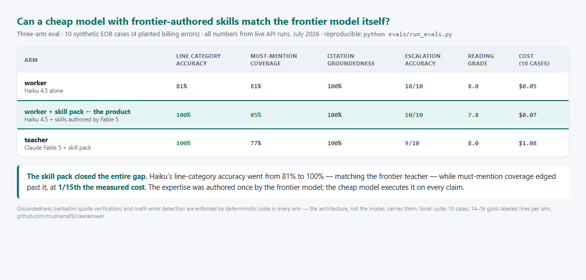
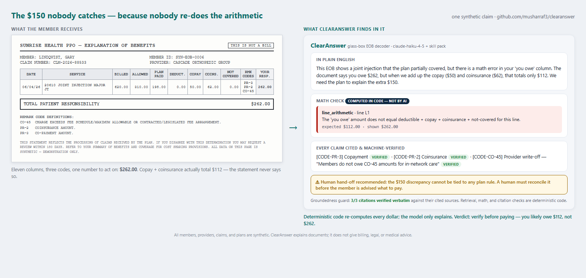
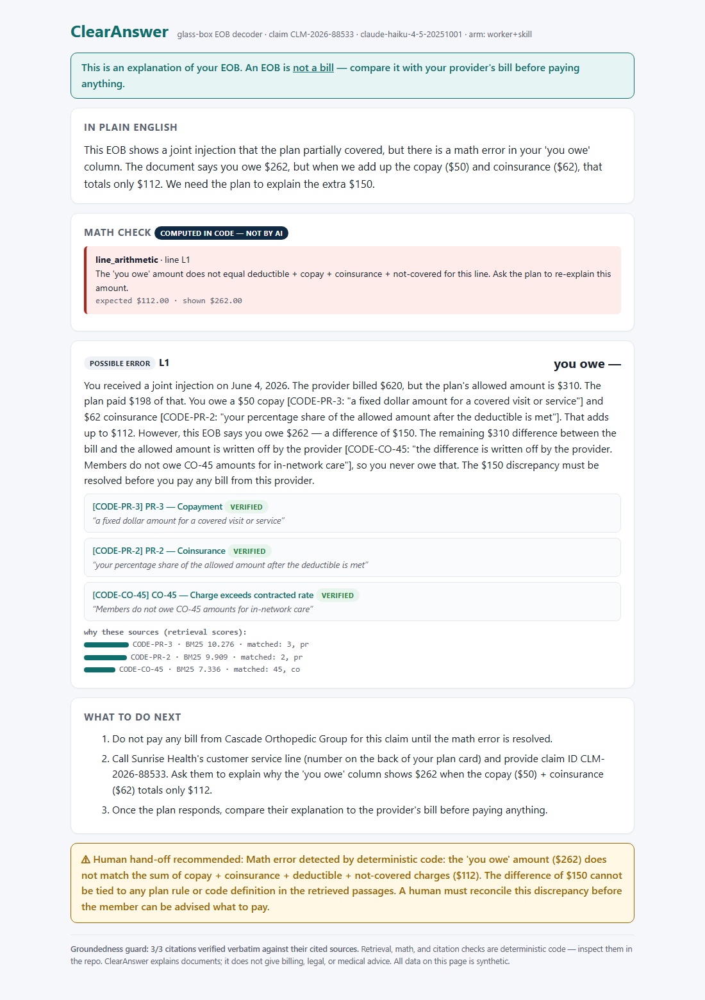
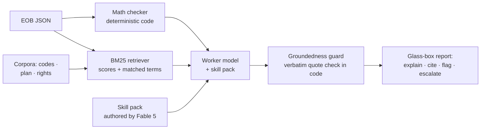

# ClearAnswer — a glass-box RAG copilot for the document nobody understands

**Decodes Explanation of Benefits (EOB) statements into plain language — with every dollar re-checked in code, every claim cited to its source, and every uncertainty routed to a human.**

Built with Claude (`claude-fable-5` as teacher, `claude-haiku-4-5` as worker) · 100% Python standard library · MIT

---

## The problem

The EOB is the most-received, least-understood document in US healthcare. Per [KFF's consumer survey](https://www.kff.org/affordable-care-act/kff-survey-of-consumer-experiences-with-health-insurance/), a majority of insured adults hit problems using their coverage in a year, about half report difficulty understanding some aspect of their insurance, and roughly 3 in 10 can't understand their EOBs. People pay bills they don't owe (CO-group write-offs shifted to patients, duplicate lines, charges past their out-of-pocket max) because nothing translates the document — and nothing checks its math.

## Why "glass box" — four engineering choices, not a metaphor

1. **The model never does arithmetic.** Deterministic Python re-computes every line (`clearanswer/mathcheck.py`) — deductible + copay + coinsurance + not-covered vs "you owe," coinsurance against the plan's actual rate, duplicates, CO-group liability, the out-of-pocket max — *before* the model sees the document. AI explains; code verifies.
2. **Retrieval you can read.** BM25 over three human-readable corpora (adjustment-code dictionary, plan benefits, patient rights). Every retrieved passage carries its score *and the exact matched terms* into the output. No opaque embedding similarity.
3. **Citations are enforced, not requested.** Every statement about a code, plan rule, or right must name a chunk ID plus a verbatim quote — and code verifies the quote exists in that specific chunk (`clearanswer/grounding.py`). Failures are flagged for human review, never silently trusted.
4. **Refusal is a feature.** Low groundedness, uncovered questions, or any code-detected billing error triggers escalation to a human. The system is designed to know when it should not answer.

## The teacher/worker economics (skill distillation)

Frontier models are superb and expensive: Claude Fable 5 lists at $10/$50 per 1M tokens; GPT-5.6 Sol at $5/$30. Haiku 4.5 costs $1/$5 — a 10x gap. ClearAnswer's bet: have the frontier model author a **skill pack** once ([`skills/eob-decoding.md`](skills/eob-decoding.md) — a decision tree, domain invariants, tone rules, worked exemplars), then run the cheap model with that skill at runtime.

The three-arm eval harness measures exactly what that buys:

| Arm | Model | What it tests |
|---|---|---|
| `worker` | Haiku 4.5 | baseline, no skill pack |
| `worker+skill` | Haiku 4.5 + Fable 5's skill pack | the product configuration |
| `teacher+skill` | Fable 5 | quality ceiling |

Results (line-category accuracy, must-mention coverage, citation groundedness, escalation accuracy, reading grade level, real token costs) are generated by `python evals/run_evals.py` from live API runs and committed in [`evals/results.md`](evals/results.md).

**July 2026 run:** the skill pack closed the entire gap — worker+skill hit 100% line-category accuracy (worker alone: 81%), matching the teacher and edging past it on must-mention coverage (85% vs 77%), at **1/15th the measured cost** ($0.07 vs $1.08 for the 10-case suite).



## The gap, on one claim

`eob_06` plants the most common kind of EOB harm: a "you owe" column that is $150 more than the sum of its own parts. The statement never says so — deterministic code catches it, the model explains it with machine-verified citations, and the case is routed to a human:



The full glass-box HTML report for the same claim (`python -m clearanswer report --eob examples/eobs/eob_06.json --offline`):



## Quickstart

```bash
git clone https://github.com/musharraf3/clearanswer.git
cd clearanswer

# Offline demo (no key, no installs — replays cached outputs from real API runs;
# the math checker and groundedness guard still execute live on your machine):
python -m clearanswer decode --eob examples/eobs/eob_06.json --offline

# Glass-box HTML report:
python -m clearanswer report --eob examples/eobs/eob_06.json --offline

# Live mode + full evals (uses urllib — still zero dependencies):
export ANTHROPIC_API_KEY=sk-ant-...
python -m clearanswer decode --eob examples/eobs/eob_09.json --arm worker+skill
python evals/run_evals.py
```

## What the demo cases cover

Ten synthetic EOBs: clean preventive care, deductible/coinsurance/copay phases, a not-covered denial with appeal rights, a No Surprises Act emergency, a bundled surgical line — plus four **planted errors** the math checker must catch: a duplicate charge, a "you owe" that exceeds the sum of its parts, coinsurance billed past the out-of-pocket maximum, and a provider's timely-filing write-off shifted into the member's column.

## Architecture



## Responsible use

Every member, provider, claim, and plan in this repository is synthetic. Code meanings are simplified consumer explanations of public X12 standards. ClearAnswer explains documents; it does not give billing, legal, or medical advice, and it never instructs payment. See [DISCLAIMER.md](DISCLAIMER.md).

## Author

**Musharraf Shaikh** — healthcare data professional writing about transparent AI for US healthcare. [LinkedIn](https://www.linkedin.com/in/musharraf-shaikh/)

Weekend Builds in Healthcare AI · #2 (see [#1 FirstPass](https://github.com/musharraf3/firstpass-prior-auth)). Built with Claude Fable 5 in Claude Cowork.

*Personal project. Views and code are my own — not affiliated with, endorsed by, or based on any employer's data, processes, or systems.*

MIT License — see [LICENSE](LICENSE).
